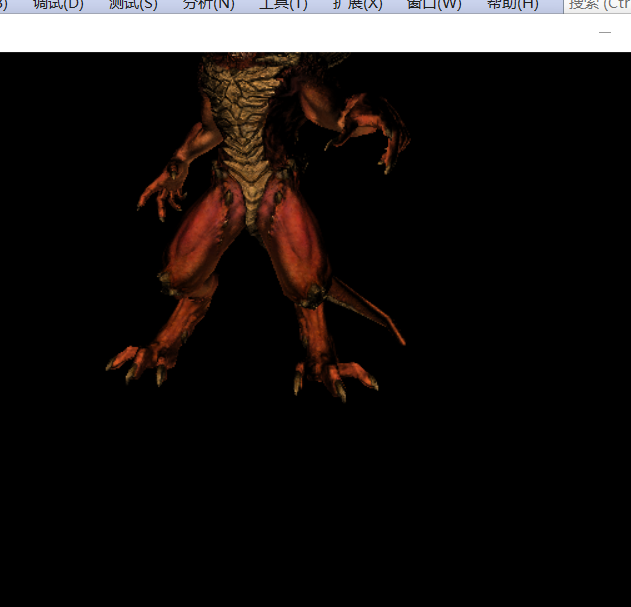
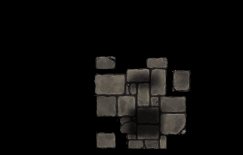

# Tiny software renderer in windows #
This project is a simple software renderer on Windows. Despite the C/C++ standard libraries and Windows SDK it has no other third party dependency. The features of it includes:

* programable shader
* skeleton skinned animation
* keyborad and mouse controlable cameral
* homogeneouse clipping
* perspective correct interpolation
* shadow map
* diffuse map
* normal map
* specular map
## build 
To compile the project, you have to intall cmake and visual studio on your  system, clonning this project to your system and type folowing command line :

    cd window
    mkdir build
    cd build
    cmake ..
then open the visual studio project 3dViewer.sln in current folder and compile the release version of the source using your visual studio.  
Then you will see the binary 3dViewer.exe in the release folder.

## demos 

Skeleton Animation

controlable cameral

homogeneous space clipping

shadow map

perpective correct interpolation
